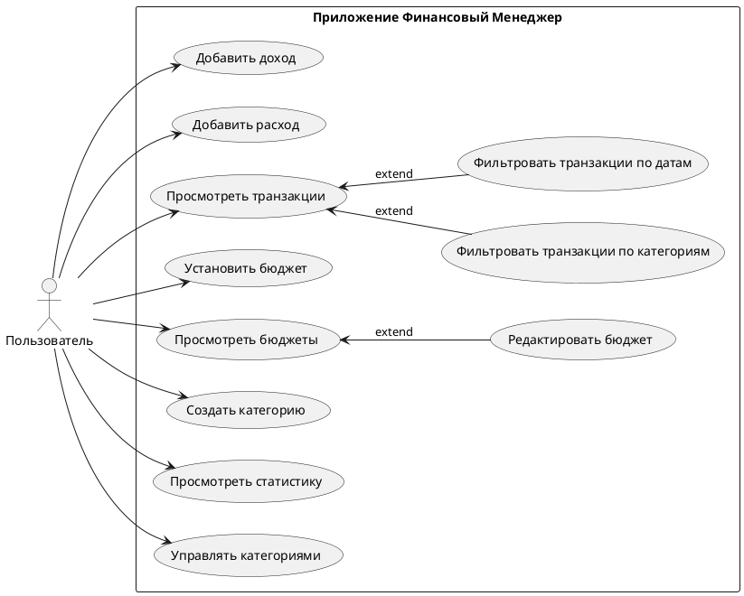
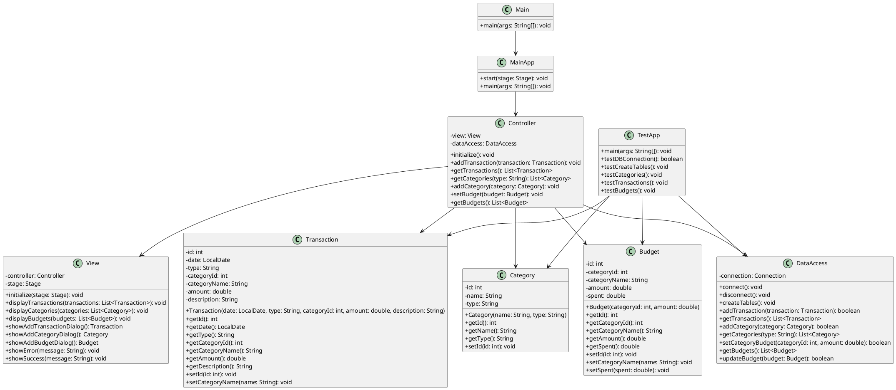
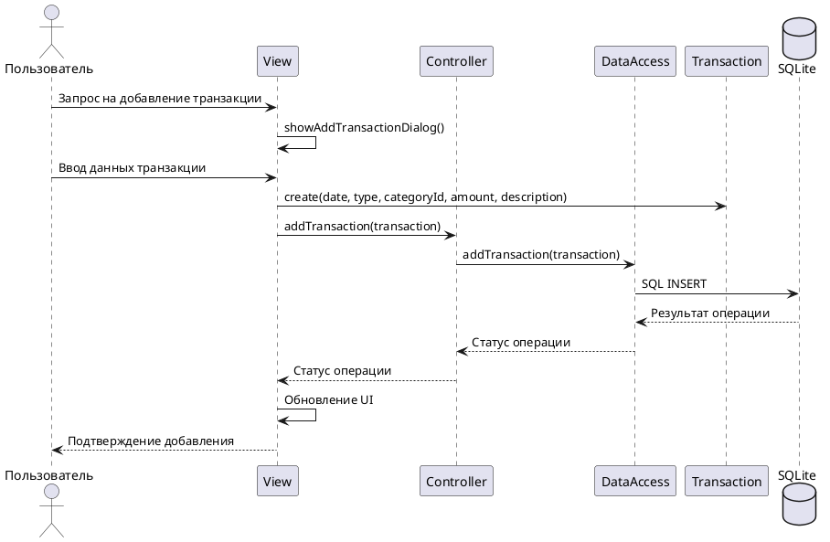
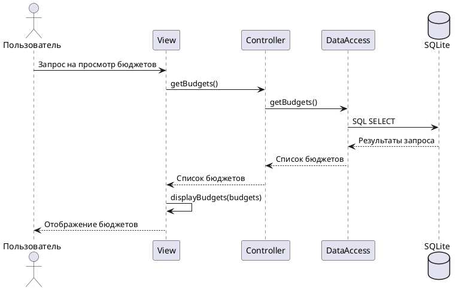
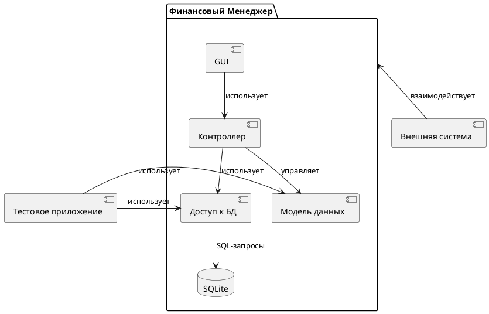

# Диаграммы Финансового Менеджера

В этом документе представлены диаграммы, иллюстрирующие различные аспекты приложения "Финансовый Менеджер". Диаграммы представлены в формате PlantUML, который можно преобразовать в графические изображения с помощью онлайн-редакторов или плагинов для IDE.

## Диаграмма вариантов использования (Use Case Diagram)

### Описание вариантов использования

1. **Добавить доход** - Пользователь может добавить новый доход, указав категорию, сумму, дату и описание.
2. **Добавить расход** - Пользователь может добавить новый расход, указав категорию, сумму, дату и описание.
3. **Просмотреть транзакции** - Пользователь может просматривать список всех транзакций (доходов и расходов).
4. **Фильтровать транзакции по категориям** - Расширение варианта "Просмотреть транзакции", позволяет фильтровать транзакции по выбранным категориям.
5. **Фильтровать транзакции по датам** - Расширение варианта "Просмотреть транзакции", позволяет фильтровать транзакции по диапазону дат.
6. **Установить бюджет** - Пользователь может установить бюджет для определенной категории расходов.
7. **Просмотреть бюджеты** - Пользователь может просматривать установленные бюджеты и их текущее состояние.
8. **Редактировать бюджет** - Расширение варианта "Просмотреть бюджеты", позволяет изменить сумму существующего бюджета.
9. **Создать категорию** - Пользователь может создать новую категорию доходов или расходов.
10. **Просмотреть статистику** - Пользователь может просматривать статистику доходов и расходов.
11. **Управлять категориями** - Пользователь может просматривать, добавлять и редактировать категории.

## Диаграмма классов (Class Diagram)

### Описание классов

1. **Main** - Основной класс приложения, точка входа.
2. **MainApp** - Класс, наследующий от `javafx.application.Application`, отвечает за инициализацию JavaFX.
3. **Controller** - Реализует логику взаимодействия между моделью данных и представлением (паттерн MVC).
4. **View** - Отвечает за графический интерфейс пользователя.
5. **DataAccess** - Обеспечивает взаимодействие с базой данных SQLite.
6. **Transaction** - Представляет отдельную транзакцию (доход или расход).
7. **Category** - Представляет категорию доходов или расходов.
8. **Budget** - Представляет бюджет для категории расходов.
9. **TestApp** - Класс для тестирования основных функций без GUI.

## Диаграмма последовательности (Sequence Diagram)

### Пример: Добавление новой транзакции

### Пример: Просмотр бюджетов

## Компонентная диаграмма (Component Diagram)

### Описание компонентов

1. **GUI (Пользовательский интерфейс)** - Компонент, отвечающий за отображение данных и взаимодействие с пользователем. Реализован с использованием JavaFX.
2. **Контроллер** - Компонент, реализующий бизнес-логику приложения и связывающий пользовательский интерфейс с моделью данных.
3. **Модель данных** - Компонент, содержащий классы для представления данных (Transaction, Category, Budget).
4. **Доступ к БД** - Компонент, обеспечивающий доступ к базе данных SQLite.
5. **SQLite** - База данных для хранения всех данных приложения.
6. **Тестовое приложение** - Отдельный компонент для тестирования функциональности без GUI.
7. **Внешняя система** - Любая внешняя система, которая может взаимодействовать с приложением (например, будущие расширения).

## Как использовать эти диаграммы

Вы можете визуализировать эти диаграммы с помощью:

1. Онлайн-редактора PlantUML: http://www.plantuml.com/plantuml/
2. Плагинов для различных IDE (IntelliJ IDEA, Visual Studio Code и др.)
3. Командной строки с установленным PlantUML

Просто скопируйте код диаграммы между тегами \`\`\`plantuml и \`\`\` в соответствующий инструмент.
